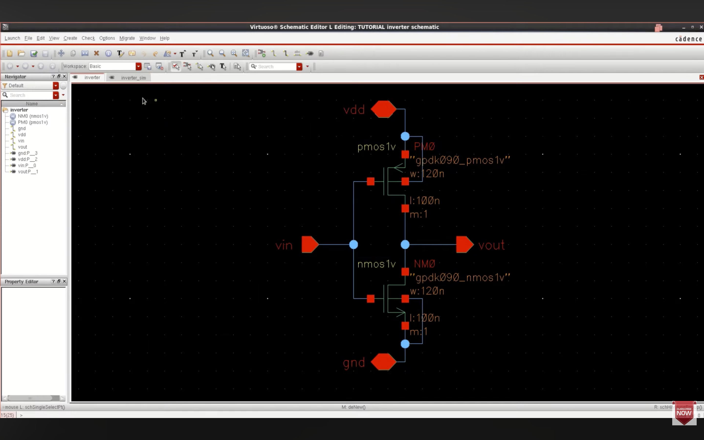

# CMOS-VLSI-Design-Cadence
CMOS logic and sequential circuit design with schematic, simulation, layout, DRC &amp; LVS using Cadence Virtuoso.
# 🧠 CMOS VLSI Design using Cadence Virtuoso

This repository contains transistor-level CMOS circuit design, simulation, and physical layout verification performed using **Cadence Virtuoso**.

---

## 🔄 Complete Design Flow Implemented

- Schematic Design
- DC Analysis (Voltage Transfer Characteristics)
- Transient Simulation
- Functional Verification
- Layout Design
- DRC (Design Rule Check)
- LVS (Layout vs Schematic Verification)

---

## 📌 Circuits Designed

### 🔹 Combinational Logic
- CMOS Inverter
- 2-Input NAND Gate
- 2-Input NOR Gate
- XOR & XNOR
- Half Adder
- Full Adder
- 2:1 Multiplexer
- 4:1 Multiplexer

### 🔹 Sequential Logic
- D Flip-Flop
- SR Flip-Flop
- JK Flip-Flop

---

## 🏗 Layout Verification

- DRC: ✅ Zero Errors
- LVS: ✅ Netlist Matched
- Physical layers used: N-well, Diffusion, Poly, Metal

---

## ⚙ Tools Used

- Cadence Virtuoso (Schematic & Layout)
- ADE for DC & Transient Analysis

---

## 🎯 Key Concepts Applied

- CMOS Pull-Up & Pull-Down Networks
- W/L Ratio Optimization
- Propagation Delay Analysis
- Switching Characteristics
- Sequential Timing Behavior
- Layout Parasitic Awareness

---

## 📎 About This Project

This project demonstrates complete front-end and back-end CMOS design flow used in digital VLSI systems and semiconductor design environments.

---

👨‍💻 Author: Shashikant

## CMOS Inverter

